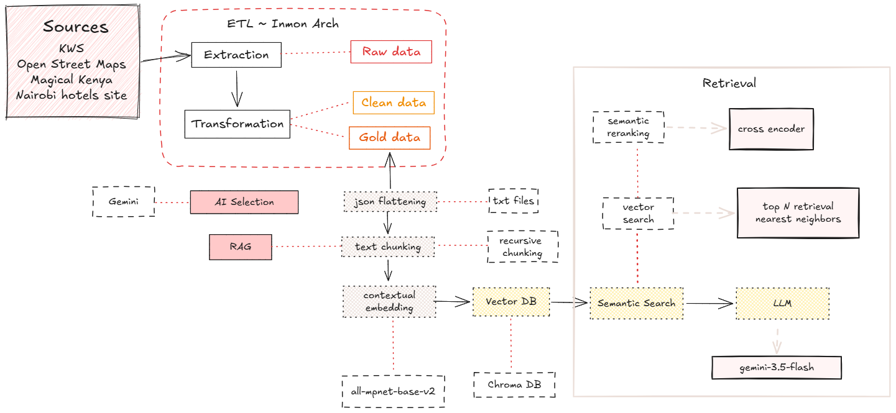

# Kenyan Tourism Intelligence App

This project is a small travel assistant for Kenya built with FastAPI, LangChain, Chroma, and Gemini. It loads local tourism data, embeds it for retrieval, and answers trip-planning questions such as destinations, hotels, campsites, parks, and safari itineraries.

## Project purpose

The app lets a user ask natural-language questions like:

- "Plan a 3-day safari in Maasai Mara"
- "Suggest hotels in Nairobi under a certain budget"
- "What are the best parks and lodges near Mombasa?"

It uses a vector database and reranking pipeline to find relevant content and then generates a structured travel response.

## Architecture


## Setup

1. Clone the repository and open it in your terminal.
2. Install `uv` if it is not already available:

   ```bash
   pip install uv
   ```

3. Create and activate the project environment with uv:

   ```bash
   uv venv
   source .venv/bin/activate
   ```

   Windows PowerShell:

   ```powershell
   uv venv
   .\.venv\Scripts\Activate.ps1
   ```

4. Install dependencies:

   ```bash
   uv pip install -e .
   ```

5. Create a `.env` file in the project root with your Gemini API key:

   ```env
   GEMINI_API_KEY=your_api_key_here
   ```

5. Confirm the local vector database exists in `data/chroma_db`.

## Run the app

Start the API with:

```bash
uv run main.py
```


The app will be available at:

- http://127.0.0.1:8001/
- http://127.0.0.1:8001/home

## Test it from the command line

### Health check

```bash
curl http://127.0.0.1:8001/
```

Expected output:

```json
{"status": "App is running"}
```

### Query the travel assistant

```bash
curl -X POST http://127.0.0.1:8001/query \
  -H "Content-Type: application/json" \
  -d '{"question":"Plan a 3-day safari in Maasai Mara with lodge options and budget guidance."}'
```

This should return a JSON response with fields such as `intro`, `highlights`, `itinerary`, `missing_info`, and `follow_up_questions`.

## Notes

- The first startup may download embedding and reranking models, so network access may be required.
- The application persists vector search data in `data/chroma_db`.
- If the API returns errors, verify that the `GEMINI_API_KEY` environment variable is set correctly.

## Main files

- `main.py` — FastAPI entry point and app startup
- `RAG/retriever.py` — retrieval and Gemini response generation
- `RAG/embeddings.py` — embedding setup
- `data/` — local source data and persistent Chroma database
- `templates/` and `static/` — web UI assets
